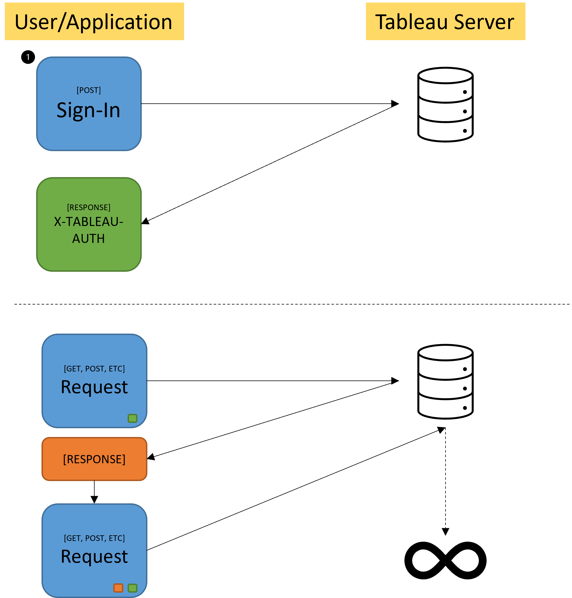
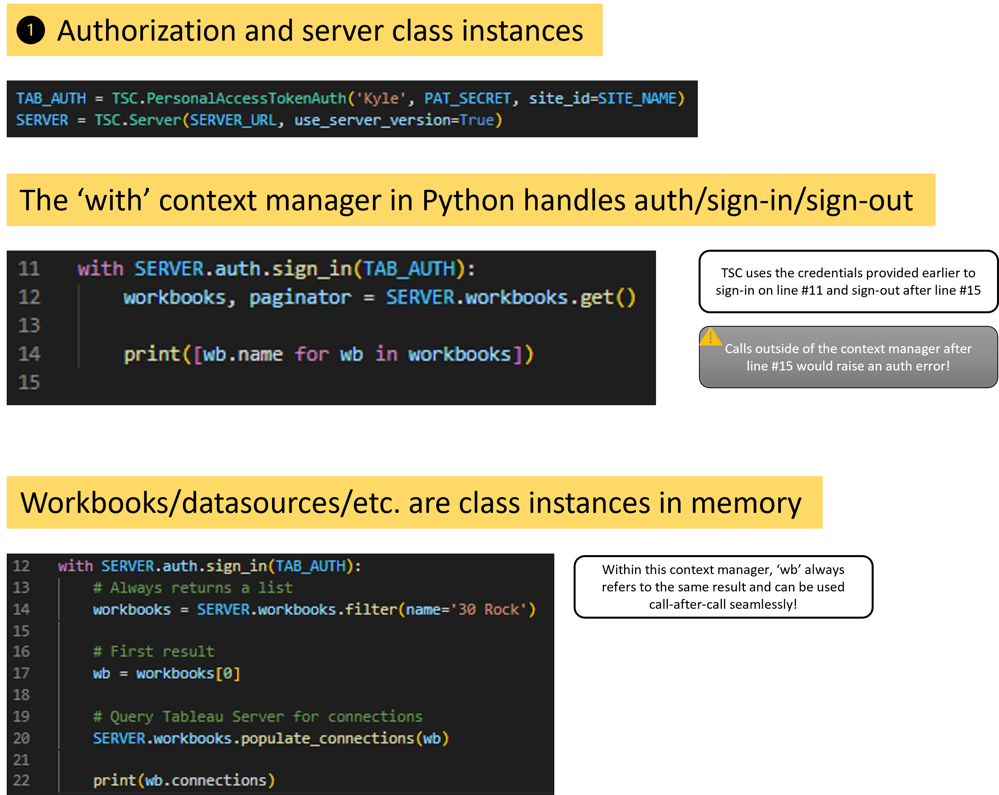

# Tableau Server Client (TSC) for Python
---
Up until now in TCI, we have focused on the Tableau Server REST API because understanding API/HTTP fundamentals is very important for successfully navigating the world of data while coding, but it also let us focus on Python fundamentals before throwing in anything related to Tableau.

The **Tableau Server Client (TSC)** library serves as a 'bridge' in many ways for coders who want to automate tasks using Python, but don't want to manage creating/storing/manipulating multitudes of XML/JSON request bodies -- which is very 'un-pythonic.' TSC is essentially a very sophisticated 'boundary layer' for making REST API calls to Tableau Server. It presents the user with classes, methods and functions that take the input and turn it into calls the REST API can understand.

It's important to note that there is not 100% parity between the capabilities of the REST API and of TSC. For example, you cannot filter a project directly by it's luid in TSC. Sometimes TSC may require calling multiple functions to produce an output that might be possible in one step with the REST API. 

**TL;DR:** IMHO, the pythonic nature of TSC, i.e. not having to store or memorize request bodies, is almost *always* worth it!

## Installing TSC
*Be sure to create a virtual environment*

`
pip install tableauserverclient
`

## Importing TSC in a module

`
import tableauserverclient as TSC
`

---

## Comparing REST API and TSC interactions
#### Simplified REST API Flow

#
#### TSC Interactions

